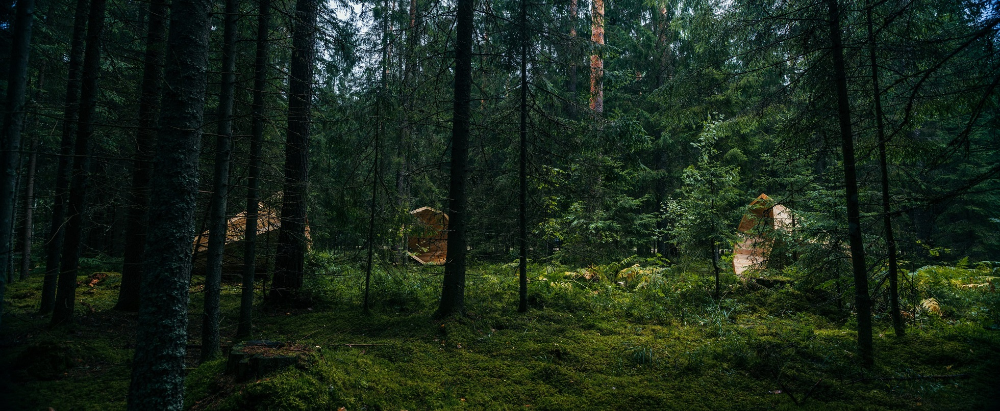
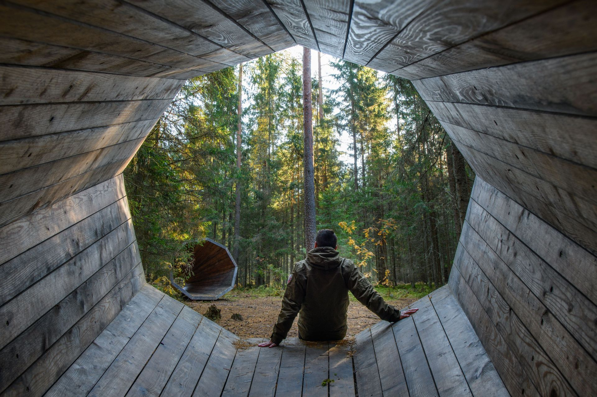

## Ruup, forest library

Giant megaphones are used to listen to the forests of Estonia and to create a library of sounds collected directly from the landscape – an audible book of nature. The installation seeks to reaffirm the profound connection between the country’s culture and its natural environment, inviting us to consider the possibility of a divine message emerging from the forest. It encourages wanderers to linger within these structures, waiting for the forest’s message to reveal itself through both sound and silence. Through active listening, we reconnect our “ecological self” with the ancestral, two-way communication that once existed between humans and the forest.

### Material

Local wood

### Design

Birgit Õigus, Tõnis Kalve, Ahti Grünberg and [b210](https://www.b210.ee/).

### Manufacturing

Interior Architecture Department of the Estonian Academy of Arts (EKA) 2015

### Location

Võrumaa, Pähni Nature Centre, Estonia

<carousel-gallery>

</carousel-gallery>
