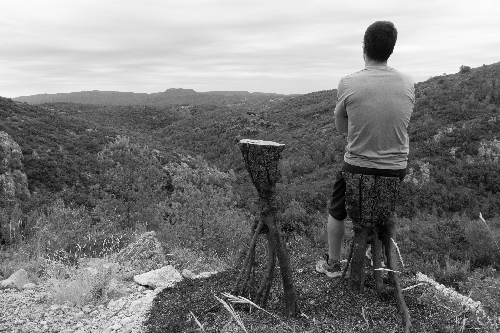
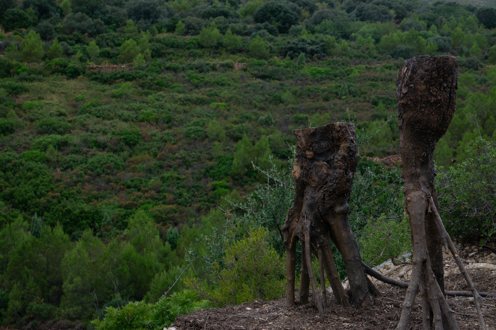
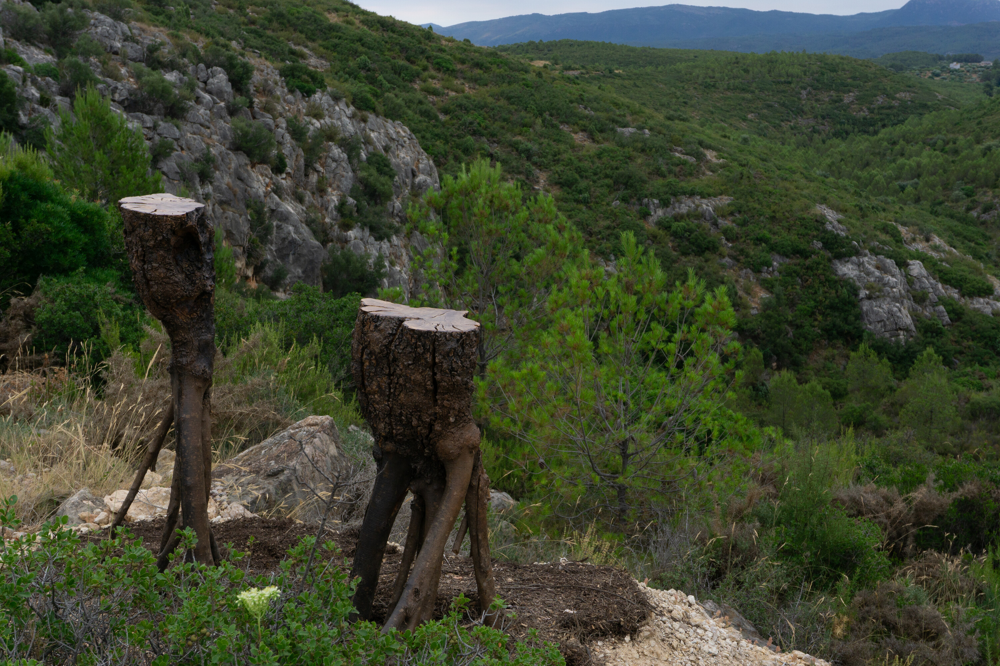
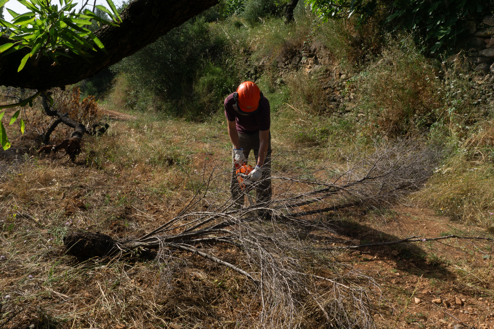

## Inverted creatures

Elements designed from a biocentric and multispecies perspective. The final
result questions consumption and production models through its own materiality:
it uses agricultural waste, the environmental impact in manufacturing is minimal
and proposes an aesthetic of sobriety that contrasts with the excess of the
dominant material culture, offering an alternative based on respect for natural
cycles. The name "inverted" moves away from its pejorative sense to become a
transformative force from a practice situated in networks of coexistence and
interdependence between species, thus enhancing ecological empathy.

### Material

Local solid olive wood.

### Design

Carmela Forés

### Manufacturing

Carmela Forés and Carles Escrig

### Location

Barranc de la Palanca, Les Useres, Castelló.

<carousel-gallery>

</carousel-gallery>
