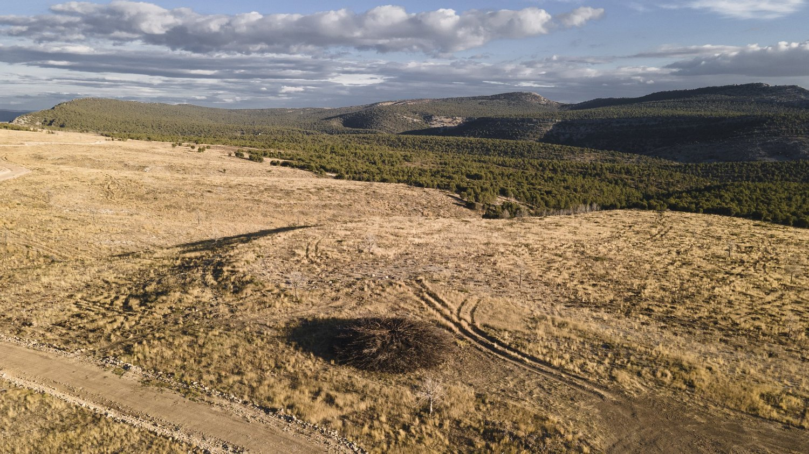
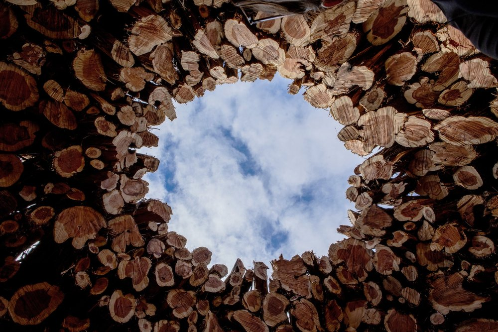

## Socarrado, a shelter for reflection

 Socarrado is a poetic installation that transforms a landscape marked by fire into a space of resistance. Built with juniper logs burned in the 2022 forest fire in the Sabinares del Arlanza Natural Park, it forms a circular shelter inspired by the traditional loberas, shelters where shepherds protected their flocks at night. This ephemeral space invites people to enter and reconnect with silence, authenticity and the possibility of renewal even among the ashes of destruction.
 

### Material

Made from burned juniper (sabina) trunks . The trunks were transported and assembled into a circular structure, culminating in a 3-meter diameter dome (lobera).

### Design

[Nomad Studio](https://www.thenomadstudio.net/socarrado)

### Manufacturing

[Somacyl](https://somacyl.es/), provided the juniper wood. 
Triturados Montero, moved the trunks. 
[Almudena Cadalso](https://www.almudenacadalso.com/), documented the process.  

### Location
Sabinares del Arlanza Natural Park, La Yecla, Burgos

<carousel-gallery>

</carousel-gallery>
