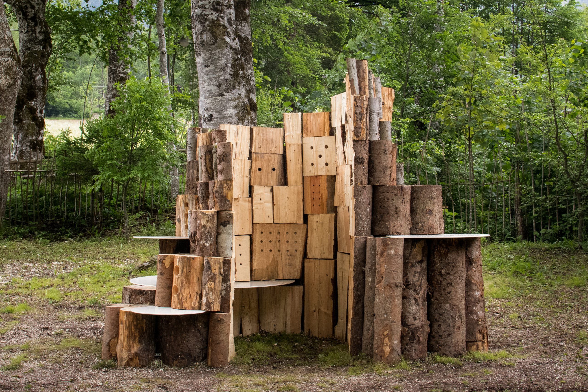
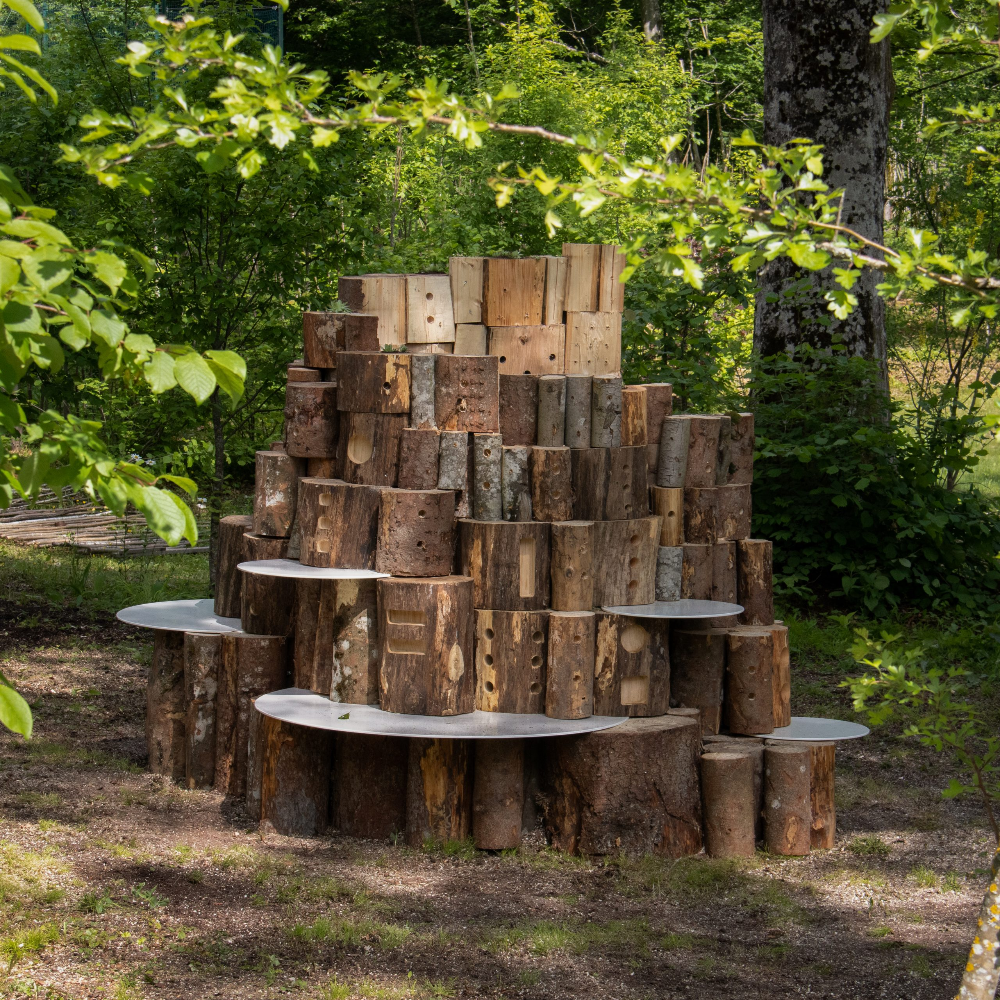
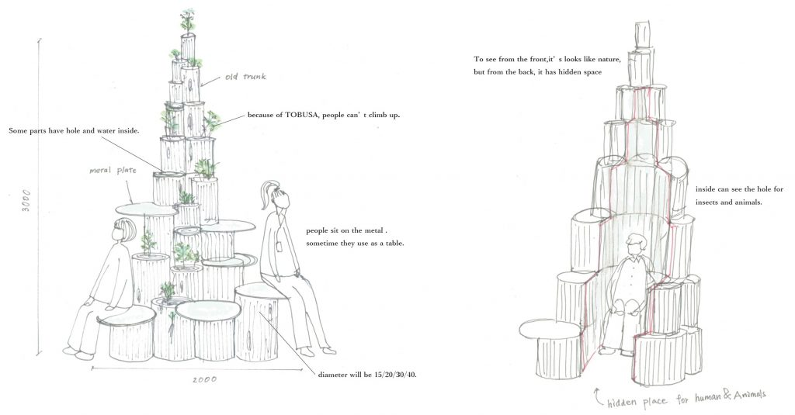
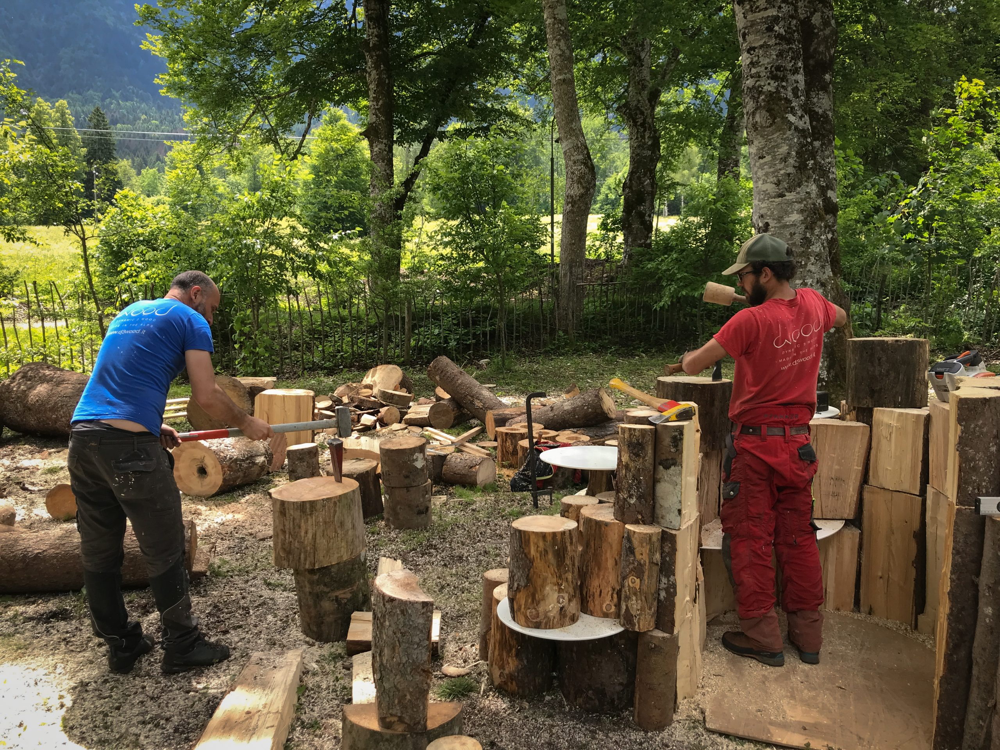

## Tobusa shared bench

The Tobusa bench symbolizes a rebirth of tree trunks felled by the storm, which
now become seats, homes for small plantations and shelters for the inhabitants
of the local forest ecosystem. The installation is composed of individual
stacked logs, varying in size, diameter (from 80 mm to 450 mm) and height, which
varies according to the level of overlap between individual logs. Some of the
larger logs were also CNC machined to create a regular geometric pattern of
holes suitable for housing insects that populate the forest vegetation of Val di
Sella.

### Material

Tree trunks felled by storm Vaia in Triveneto (2018) and galvanized steel for
seating.

### Design

[Satoko Shinohara](https://www.s-d-s.net/)

### Manufacturing

[D3Wood](https://www.d3wood.it/), [Nordzinc](https://www.nordzinc.com/en/)

### Location

Arte Sella, Villa Strobele, Borgo Valsugana (TN)

<carousel-gallery>

</carousel-gallery>
