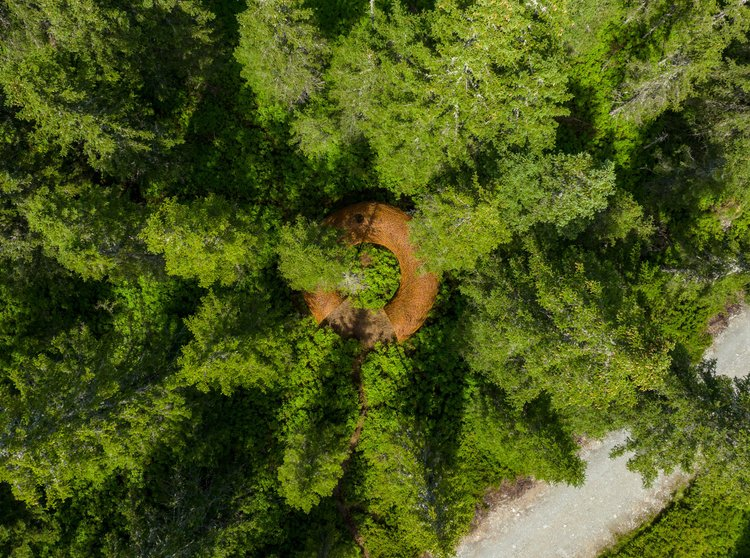
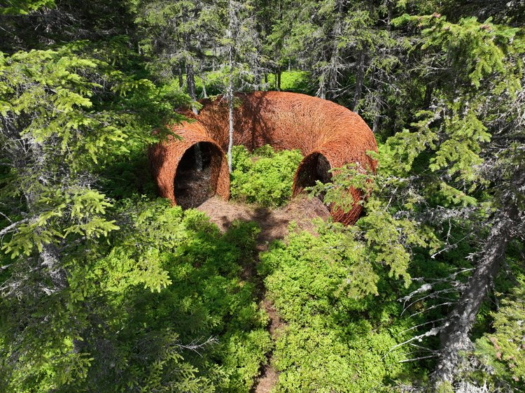
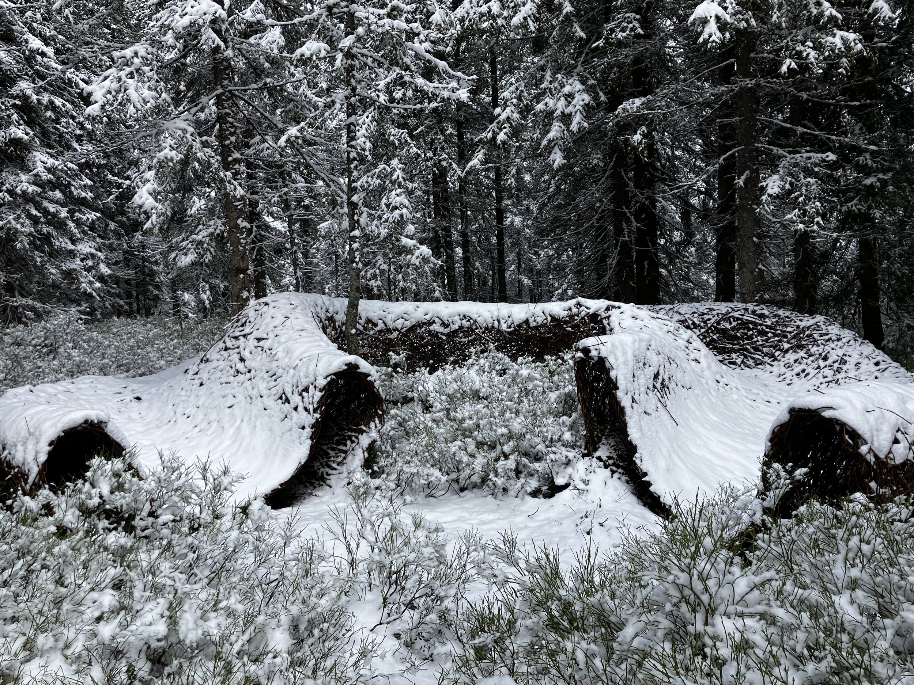
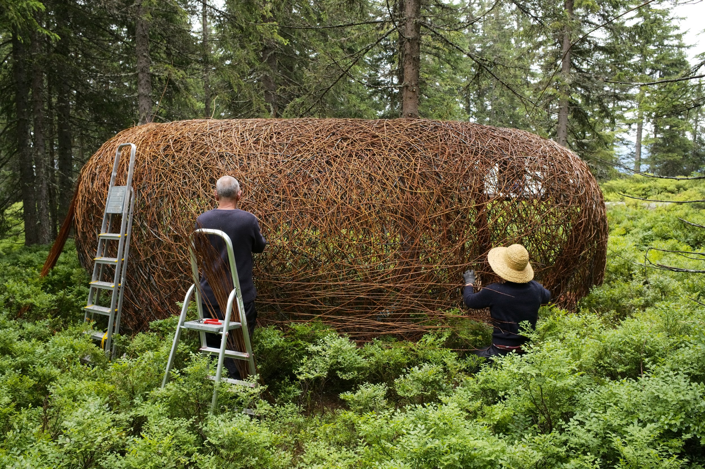
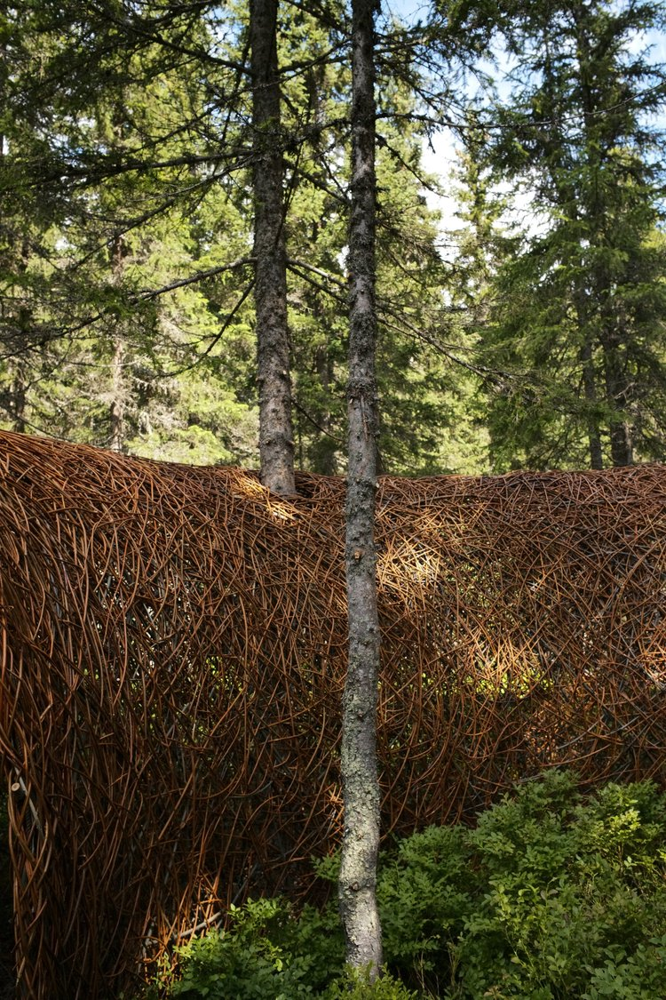
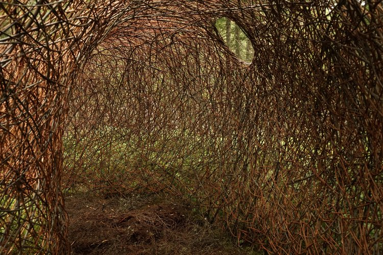
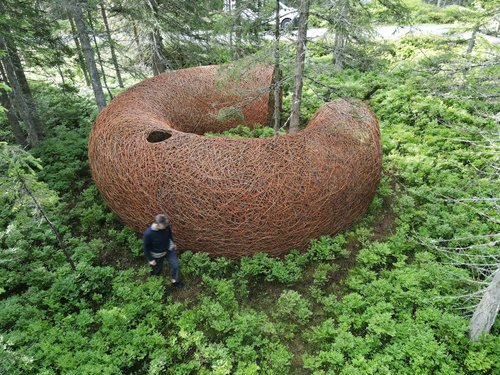
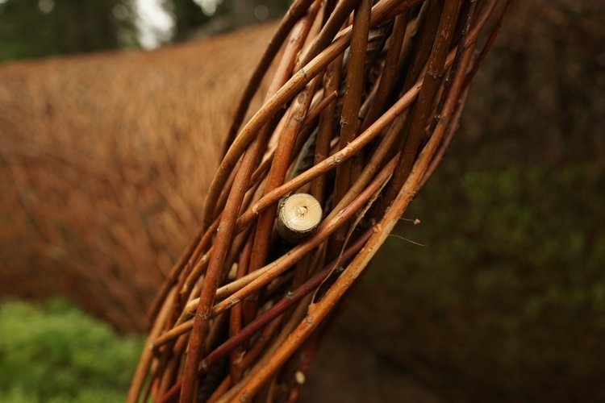

---
coordinates:
  - 47.42303
  - 13.625016
title: 'Tunnel of hope, going into nature'
description: >-
  
<strong>Tunnel of hope, Rittisberg Trail</strong>— <em>a space from which
  to be an observer or an observed</em>

cover: ./tunnel-hope-007.jpg
---
## Tunnel of hope
This object, by Danish artist Jette Mellgren, is part of the “Rittisberg
Landart” project, which aims to go beyond the region’s tourist development and
create immersive environments that encourage an appreciation of nature through
our interdependence with it. Using traditional basketry techniques and local
materials, the artist invites us to shift our perspective by drawing us into a
space from which to feel, contemplate, observe—or be observed. From within, the
bearer of the narrative is not always the human.

### Material
Different kinds of willow

### Design
Jette Mellgren

### Manufacturing
Tunnel - Jette Mellgren & Jan Johansen
Photos - Jette Mellgren, Jan Johansen & Rittisberg Landart

### Location
Rittisberg, Ramsau am Dachstein, Austria, 2023

<carousel-gallery>
  

</carousel-gallery>
