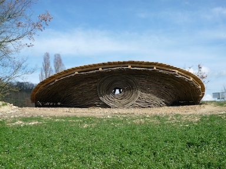
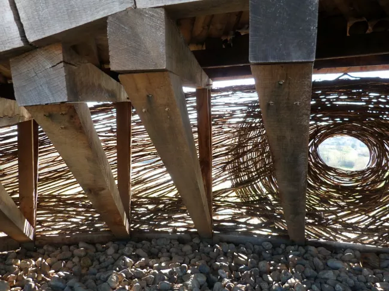

## Yané, community space

Yané, which means roof in Japanese, is a large fan (10 meters in diameter) formed by long oak planks that reveal a cyclopean eye made of twisted branches. It is installed at the viewpoint of the PR31 trail, from where you can see Villefranche and the Pyrenees in the distance. This place invites you to take refuge and to prolonged observation, which provokes a reflection on the place of humanity in nature and on the fragility of the balances in ecosystems threatened by our activities. The work was created, with the voluntary help of the community, during an artist residency in 2012.

### Material

The wood platform is made of long oak planks that reveal a cyclopean eye made of twisted branches

### Design

[Teruhisa Suzuki](https://ter-suzuki.com/)

### Manufacturing

The participation of local citizens and others professionals in the design and manufacturing of the works is a fundamental element of this project. Their contribution is estimated at 3,500 hours of volunteer work.

### Location

Villefranche-Astarac, France

<carousel-gallery>

</carousel-gallery>
