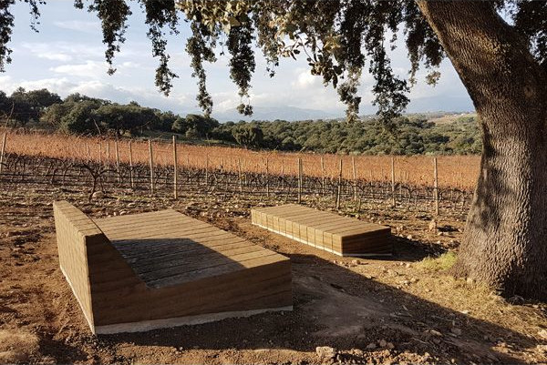
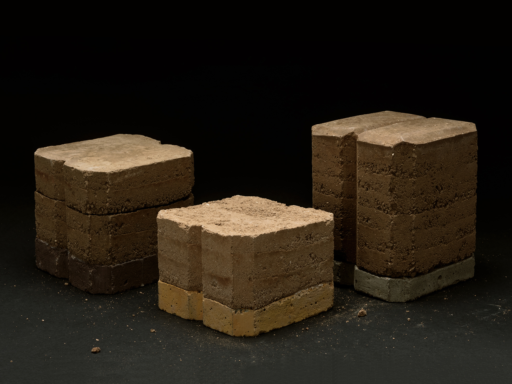

## Rammed earth benches

Benches designed to extend the experience of people visiting the wineries.
Through their use, visitors can rest in different parts of the estate and enjoy
a full immersion in the landscape. The ecological aesthetic accompanies this
experience since the benches use local resources and low-energy manufacturing.

### Material

Earth, water and lime. 5m³ of local earth stabilized with 5% cement. Rammed
earth construction method consisting of building walls by filling formwork with
different layers of moist clay soil, manually compacted with a rammer.

### Design

[Pensando en blanco](https://pensandoenblanco.com/project/bancos-de-tapia-c-o-cla/)

### Manufacturing

[Terram](https://www.terram.cat/portfolio/bancs-de-tapia-celler-a-ronda-malaga/)

### Location

Cortijo _Los Aguilares_ in Ronda, Málaga.

<carousel-gallery>

</carousel-gallery>
