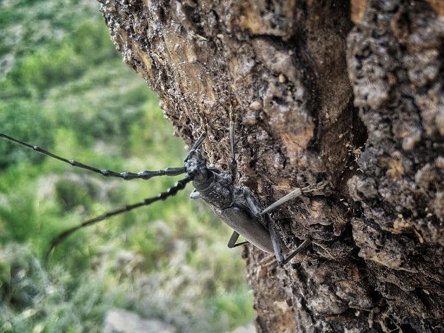

## Criatures invertides sobre el Barranc de la Palanca

Elements dissenyats des d’una perspectiva biocèntrica i multiespècie. El
resultat final qüestiona els models de consum i producció a través de la pròpia
materialitat: utilitza residus del camp, l’impacte ambiental en la fabricació és
mínim i proposa una estètica de la sobrietat que contrasta amb l'excés de la
cultura material dominant, oferint una alternativa basada en el respecte pels
cicles naturals. El nom d’invertides s’allunya del seu sentit pejoratiu per
esdevindre força transformadora des d’una pràctica situada en xarxes de
coexistència i interdependència entre espècies, potenciant així l’empatia
ecològica.

### Material

Fusta massissa local d’olivera.

### Disseny

Carmela Forés

### Fabricació

Carmela Forés i Carles Escrig

### Ubicació

Barranc de la Palanca, Les Useres, Castelló.

