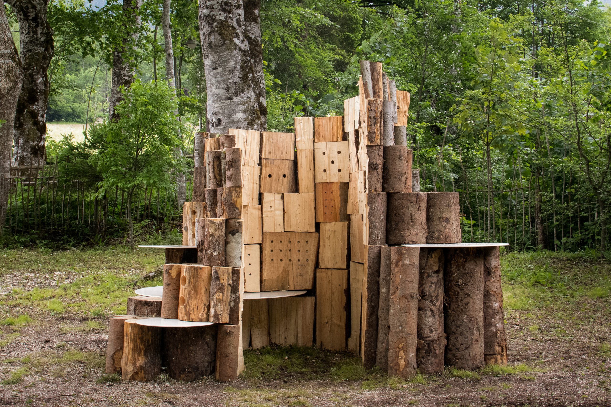
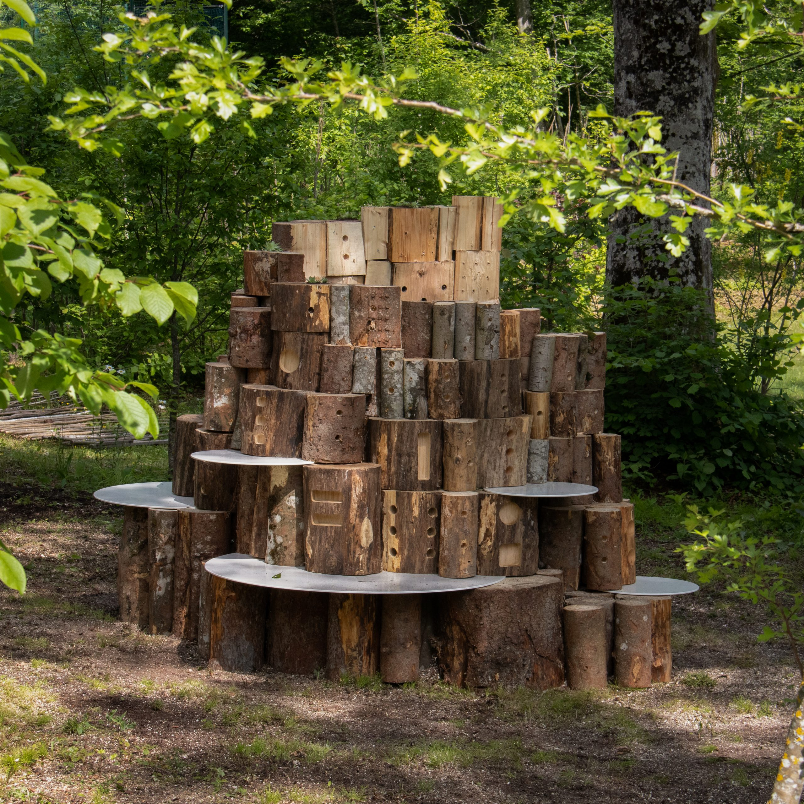
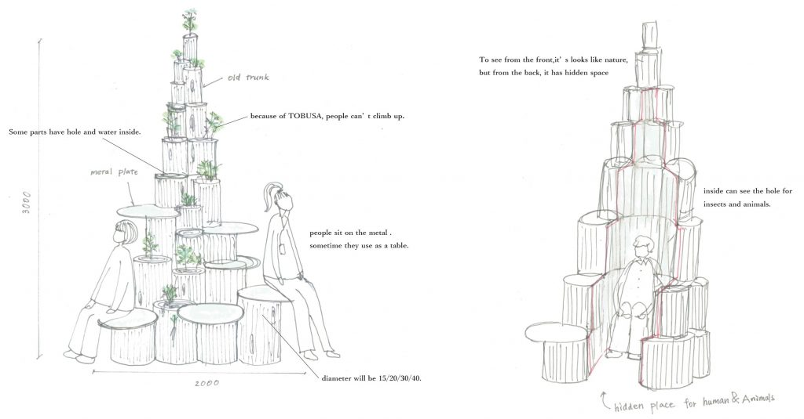
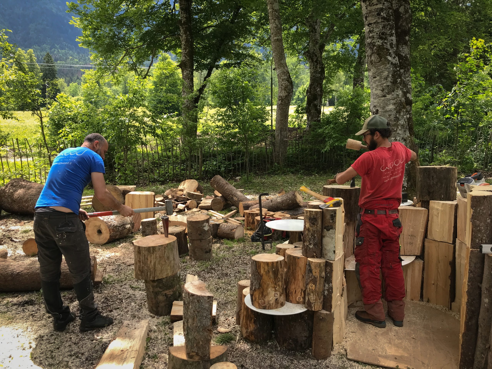

## Tobusa shared bench

El banc Tobusa simbolitza un renaixement dels troncs d'arbres talats per la tempesta, que ara es converteixen en seients, llars per a petites plantacions i refugis per als habitants de l'ecosistema forestal local. La instal·lació està composta per troncs individuals apilats, que varien en mida, diàmetre (des de 80 mm fins a 450 mm) i alçada, que varia segons el nivell de solapament entre els troncs individuals. Alguns dels troncs més grans també es van mecanitzar en CNC per crear un patró geomètric regular de forats adequats per allotjar insectes que poblen la vegetació forestal de la Val di Sella. 

### Material

Troncs d'arbres talats per la tempesta Vaia en Triveneto (2018) i acer galvanitzat per als seients.

### Disseny
[Satoko Shinohara](https://www.s-d-s.net/)

### Fabricació
[D3Wood](https://www.d3wood.it/), [Nordzinc](https://www.nordzinc.com/en/)

### Ubicació
Arte Sella, Villa Strobele, Borgo Valsugana (TN)

